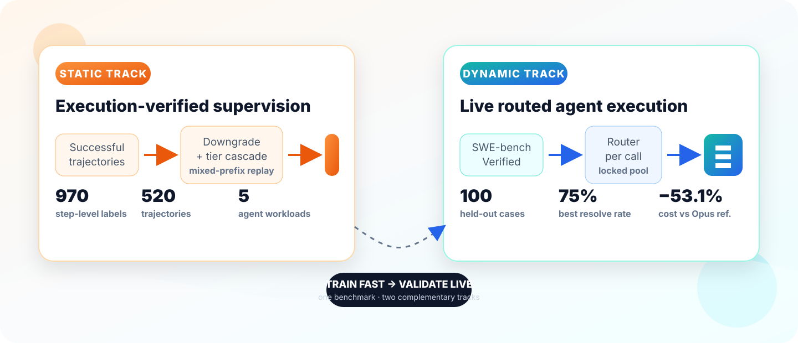

<div align="center">

# TwinRouterBench

### Fast static supervision. Live agentic routing evaluation.

**A two-track benchmark for choosing the cheapest sufficient LLM at every agent step.**

[](https://arxiv.org/abs/2605.18859)
[](https://huggingface.co/datasets/Amorph/TwinRouterBench)
[](https://commonstackai.github.io/TwinRouterBench/)
[](LICENSE)
[](https://github.com/CommonstackAI/TwinRouterBench/stargazers)

[**Project Page**](https://commonstackai.github.io/TwinRouterBench/) ·
[**Paper**](https://arxiv.org/abs/2605.18859) ·
[**Dataset**](https://huggingface.co/datasets/Amorph/TwinRouterBench) ·
[**Data Pipeline**](docs/DATA_GENERATION.md) ·
[**Submit a Router**](https://github.com/CommonstackAI/TwinRouterBench/issues/new?template=leaderboard_submission.yml)

</div>

<p align="center">
  
</p>

## Why TwinRouterBench?

Most router benchmarks make one model choice for a complete prompt. Real coding,
research, and computer-use agents make many calls under changing tool state and
conversation history. TwinRouterBench evaluates the decision the router actually
faces: **which model should handle the next call given the full current prefix?**

| Track | What it measures | Public artifact |
|---|---|---|
| **Static** | Cheapest-sufficient tier at each routed step, verified through downgrade search and mixed-model execution. | **970 labels**, **520 trajectories**, **5 workloads** |
| **Dynamic** | End-to-end task success and realized API spend while routing every live agent call. | **100 held-out SWE-bench Verified cases** |

> **Headline result.** The trained router resolves **75/100** held-out cases for
> **$25.66**, compared with **74/100** for the **$54.73** all-Opus reference—a
> **53.1% cost reduction** with comparable task success.

## Quick start

```bash
pip install -e .

# Reproduce the complete offline data-construction flow without API keys.
twinrouterbench data generate \
  --benchmark all \
  --backend mock \
  --output-dir runs/data-generation/mock-all

# Add and run a new benchmark using only data + JSON configuration.
twinrouterbench data run \
  --config configs/data_generation/custom_qa_pipeline.json \
  --output-dir runs/data-generation/custom-qa
```

The package exposes four connected surfaces:

```bash
twinrouterbench data ...       # config-driven construction/review/publish pipeline
twinrouterbench static ...     # deterministic offline router scoring
twinrouterbench dynamic ...    # live mini-swe-agent evaluation
twinrouterbench swe ...        # editor-scaffold SWE-bench evaluation
```

| Resource | Link |
|---|---|
| Interactive leaderboard and protocol | [Project page](https://commonstackai.github.io/TwinRouterBench/) |
| Static question bank | [Hugging Face](https://huggingface.co/datasets/Amorph/TwinRouterBench) |
| Data-generation methodology and CLI | [docs/DATA_GENERATION.md](docs/DATA_GENERATION.md) |
| Leaderboard submission rules | [docs/SUBMISSION.md](docs/SUBMISSION.md) |
| Citation metadata | [CITATION.cff](CITATION.cff) |

---

## Where to run commands (important)

Many examples use **paths relative to the checkout parent directory** (the parent of `TwinRouterBench/`), for example:

- `semantic-router/...` — checkout of the **semantic-router** repo (KNN weights and `models.py`).
- `TwinRouterBench/data/static/...` — static track: `question_bank.jsonl`, `manifest.json`.
- `TwinRouterBench/data/dynamic/...` — dynamic track: locked pool, pricing, TTL, tier map, SR-KNN mapping.

**Recommended:** `cd` to the checkout parent directory, `pip install -e "./TwinRouterBench[dynamic]"`, then run `twinrouterbench …` from there so those relative paths resolve.

The dynamic CLI also loads **`TwinRouterBench/.env`** via `miniswerouter.cli` (see [Configuration](#configuration)). That file is resolved from the **TwinRouterBench package directory**, not from your shell `cwd`, so keeping `.env` next to `pyproject.toml` under `TwinRouterBench/` is the supported layout.

---

## Install

**Static track only** (lightweight dependencies):

```bash
pip install -e ./TwinRouterBench
# or from PyPI once published:
# pip install twinrouterbench
```

**Full suite** (adds Docker, SWE-bench harness, mini-swe-agent, LiteLLM, etc.):

```bash
pip install -e "./TwinRouterBench[dynamic]"
```

If you run `twinrouterbench dynamic` or `twinrouterbench swe` without `[dynamic]`, the CLI exits with an explicit message to install the extra.

---

## Configuration

### `TwinRouterBench/.env`

1. Copy `TwinRouterBench/.env.example` to `TwinRouterBench/.env`.
2. Fill in real credentials (never commit `.env`).

**Load order (dynamic / mini CLI):**

1. **`_load_mini_dotenv`** — reads `TwinRouterBench/.env` and sets any key that is **missing or empty** in the process environment (already-set variables win).
2. **`_apply_gateway_aliases`** — if optional gateway override variables are set, they **override** chat-related OpenRouter/SWERouter URL and API key (see table below).

| Variable | Purpose |
|----------|---------|
| `OPENROUTER_BASE_URL` | OpenAI-compatible root URL (must end with `/v1`; clients append `/chat/completions`). Example: `https://openrouter.ai/api/v1`. |
| `OPENROUTER_API_KEY` | Bearer token for the gateway above. |
| `OPENROUTER_API_KEY_EXP` | Optional alternate key; if `OPENROUTER_API_KEY` is empty after dotenv, it is copied from this. |
| `SWEROUTER_BASE_URL` / `SWEROUTER_API_KEY` | Optional explicit names; `miniswerouterbench run` defaults fall back to `OPENROUTER_*` when unset. |
| `COMMONSTACK_API_BASE` | Optional override: if set, **replaces** `OPENROUTER_BASE_URL` and `SWEROUTER_BASE_URL` after bootstrap (legacy env name; see `.env.example`). |
| `COMMONSTACK_API_KEY` | Optional override: if set, **replaces** `OPENROUTER_API_KEY`, `OPENROUTER_API_KEY_EXP`, and `SWEROUTER_API_KEY` after bootstrap. |

**Common pitfall:** `OPENROUTER_BASE_URL` and `OPENROUTER_API_KEY` must refer to the **same** provider. Mixing a custom gateway base URL with another vendor’s API key (or the reverse) yields **401** or “invalid access key”.

Shell snippets under `TwinRouterBench/scripts/examples/env.inc.sh` mirror the Python alias logic for bash-driven runs.

### Prerequisites (dynamic track)

- **Docker** running locally; enough disk for SWE-bench images.
- **Network** for image pulls and the chat gateway.
- **API keys** as above. The dynamic CLIs load `TwinRouterBench/.env` before parsing arguments.

Static `metrics` subcommand does not need Docker or network if you only aggregate local JSON.

### semantic-router (SR KNN only)

The **SemanticRouterKNNRouter** loads:

- `knn_model.json` (feature dim 1024 + 14 category one-hot),
- `semantic-router` repo root (for `ml_model_selection/models.py` / `KNNModel.load`),
- **sentence-transformers** embedder (default `Qwen/Qwen3-Embedding-0.6B`; you should downloads weights first).

Ensure a checkout exists at `semantic-router/` relative to the checkout parent directory (or pass absolute `--router-arg` paths).

---

## Command-line interface

Primary entrypoint:

```bash
twinrouterbench data <subcommand> [args]     # construct/review/publish data
twinrouterbench static <subcommand> [args]   # static track
twinrouterbench dynamic <subcommand> [args]  # mini-swe-agent harness
twinrouterbench swe <subcommand> [args]     # editor-scaffold harness
```

Compatibility console scripts (same code after the same install):

| Script | Module |
|--------|--------|
| `CommonRouterBench` | `main.cli` (legacy console script name) |
| `miniswerouterbench` | `miniswerouter.cli` |
| `swerouterbench` | `swerouter.cli` |

For debugging without installing entrypoints:

```bash
export PYTHONPATH=/abs/path/to/TwinRouterBench
python -m miniswerouter.cli run …
```

---

## Static track

### `twinrouterbench static metrics`

Aggregates **Section 11–style** metrics from a JSON file containing an array of **CaseMetrics** objects (see `main.metrics.CaseMetrics` and `case_metrics_from_dict`).

```bash
twinrouterbench static metrics --cases /path/to/cases.json
```

Each element must at least include `case_id`, `task_passed`, and either nominal cost fields or `baseline_steps` / `optimal_steps` / `test_steps` lists with `completion_tokens` (and optional `tier` / `model`). Example skeleton:

```json
[
  {
    "case_id": "example-1",
    "task_passed": true,
    "baseline_cost_nominal": 10.0,
    "optimal_cost_nominal": 4.0,
    "test_cost_nominal": 5.0
  }
]
```

**Question bank:** shipped under **`data/static/`** (`question_bank.jsonl`, `manifest.json`). The `main` package exposes `DATA_DIR` / `STATIC_DATA_DIR` / `QUESTION_BANK_PATH` pointing at that directory (see `main.dataset`). `setuptools` package-data includes those files for wheel installs. Tier-only eval APIs live under `main.eval`.

### Static track — metric field names (outputs)

**1) `twinrouterbench static metrics --cases …`** prints one JSON object from `main.metrics.aggregate_routerbench_metrics` (Section 11–style **task-level** savings on nominal tier rates):

| Field | Meaning |
|-------|---------|
| `valid_cases` | Number of cases in the input array. |
| `passed_cases` | Cases with `task_passed == true`. |
| `pass_rate` | `passed_cases / valid_cases`. |
| `cost_score_cases_used` | Passed cases with `save_gt > 0` included in the cost ratio. |
| `sum_save_gt_usd` / `sum_save_test_usd` | Sums of per-case savings vs baseline / vs test (USD, passed + positive-save_gt subset). |
| `cost_savings_score` | `100 * sum_save_test_usd / sum_save_gt_usd` on that subset (`NaN` if denominator is 0). |
| `money_saved_test` | Per-case `baseline_nominal - test_nominal` stats over passed cases (`mean_per_case_over_passed`, `total_over_passed`). |
| `pricing` / `cost_score_rule` | Fixed tier rates used and a short rule string (documentation only). |

**2) Tier-supervision eval summary** (`main.eval.build_eval_summary` / `run_question_bank_eval`): one top-level JSON with routing rows and several metric blocks. Headline tier metrics most papers care about live under **`scores_v2`** (`main.eval.compute_v2_scores`):

| Field (`scores_v2`) | Meaning |
|---------------------|---------|
| `case_pass_rate_percent` | Row fraction with `pred_tier_id >= gold_tier_id` (errors count as fail). |
| `case_exact_match_percent` | Row fraction with `pred_tier_id == gold_tier_id`. |
| `trajectory_pass_rate_percent` | Case-weighted share of rows whose **whole trajectory** passes (every step `pred >= gold`, no error). |
| `cost_savings_score_percent` | Macro-averaged trajectory-level cost savings vs always-high baseline (see `scores_v2.note` in the JSON). |
| `combined_score_percent` | Mean of the four percentages above (`NaN` if any component is `NaN`). |
| `total_rows` / `error_rows` | Row counts; `case_pass_count` / `case_exact_count` are integer numerators. |

Other useful keys on the same summary object:

| Field | Meaning |
|-------|---------|
| `tier_match_accuracy` / `accuracy_excluding_errors` | Exact tier match rate on rows **without** API errors. |
| `exact_match` | Integer count of exact matches (same scope as tier accuracy numerator). |
| `api_errors` / `valid_response_rate` | Error count and `1 - api_errors/sampled`. |
| `section_11` | Older single-step pass rate + `cost_savings_score` (uniform tokens); distinct from `scores_v2`. |
| `router_accounting` | Trajectory-level **USD** accounting: `D_usd`, `N_usd`, `pass_rate_percent`, `exact_match_rate_percent`, `accounting_savings_score_percent`, `overall_score_percent` (mean of those three headline percents). |

---

## Dynamic track (`twinrouterbench dynamic …`)

This forwards to **`miniswerouter.cli`** (`run`, `score`, `audit-infra`, `audit-trace-cost`, `render`).

### Paper held-out split (100 SWE-bench Verified instances)

The paper’s dynamic held-out evaluation uses a fixed **100-instance** subset of **SWE-bench Verified**, disjoint from the static SWE supervision instances. The locked instance-id list is:

**[`data/dynamic/dynamic_heldout100_ids.txt`](data/dynamic/dynamic_heldout100_ids.txt)** — one `instance_id` per line (18 `astropy__*`, 82 `django__*`).

**Selection rule** (same as `leaderboard/data/leaderboard.json`):

1. Take instance IDs present in both SR-KNN and UncommonRoute dynamic result sets.
2. Remove all CommonRouterBench SWE static supervision instances.
3. Sort the remaining IDs lexicographically and keep the first 100.

To reproduce that split with the dynamic harness:

```bash
# run (pass IDs explicitly)
mapfile -t HELDOUT < TwinRouterBench/data/dynamic/dynamic_heldout100_ids.txt
twinrouterbench dynamic run ... --instances "${HELDOUT[@]}"

# score an existing run on only this split
twinrouterbench dynamic score \
  --run-dir runs/your_run \
  --router-label your_label \
  --instance-ids-file TwinRouterBench/data/dynamic/dynamic_heldout100_ids.txt
```

### `run` — main flags

| Flag | Meaning |
|------|---------|
| `--router-import` | Required. `module:factory`, e.g. `swerouter.routers.sr_knn_adapter:SemanticRouterKNNRouter.from_cli_args`. |
| `--router-arg KEY=VALUE` | Repeatable; passed as kwargs to the factory. Values are strings. |
| `--router-label` | Required label stored in `eval_summary.json` and traces. |
| `--output-dir` | Required. Run artifacts root (created if needed). |
| `--base-url` / `--api-key` | Default from `SWEROUTER_*` then `OPENROUTER_*` env after `.env` load. |
| `--instances id1 id2 …` | Optional explicit SWE-bench instance IDs. |
| `--limit N` | Optional cap on how many dataset instances to consider (ordering is harness-defined). |
| `--workers` | Parallel workers (default 2). |
| `--max-steps` | Agent step limit (default 250, matches mini-swe-agent SWE profile). |
| `--budget-usd` | Agent cost limit in USD (default 3). |
| `--run-id` | Stored in summaries; use a new id when you want a logically separate run. |
| `--force-rerun` | Re-run instances even if `results/<instance_id>.json` already exists. |
| `--pool`, `--pricing`, `--ttl`, `--tier-map` | Override locked JSON paths (defaults under `TwinRouterBench/data/dynamic/`). |

**Resume:** without `--force-rerun`, instances that already have `output_dir/results/<instance_id>.json` are skipped.

### `run` output layout

Under `--output-dir`:

- `results/<instance_id>.json` — per-instance outcome (`resolved`, `step_count`, errors, etc.).
- `<instance_id>.trace.jsonl` — per-step router and usage trace.
- `eval_summary.json` — run-level aggregate (`completed`, `resolved_count`, `errors`, …).
- `case_summaries/<instance_id>.summary.json` — condensed per-case view.
- `agent_logs/<instance_id>/agent.log` — mini-swe-agent log.

**`eval_summary.json` fields** (`miniswerouter.harness.run_eval.EvalSummary`; the `swe` harness uses the same keys via `swerouter.harness.run_eval`): `router_label`, `run_id`, `started_at`, `finished_at`, `dataset_name`, `dataset_split`, `pool_fingerprint`, `pricing_schema_version`, `ttl_policy_name` (may be empty when unused), `total_instances`, `completed`, `resolved_count`, **`resolved_rate`** (`resolved_count / completed`, same `resolved` predicate as SWE-bench), **`total_router_cost_usd`** (sum of realized routed API spend only; no failure penalty), `per_instance_paths`, `errors`.

Long stretches without new console output are normal (Docker pull, repository setup, multi-step LLM calls).

### Example — gold-tier oracle (paths under TwinRouterBench)

From the checkout parent directory, after installing `[dynamic]`:

```bash
twinrouterbench dynamic run \
  --router-import swerouter.routers.gold_tier:GoldTierRouter.from_cli_args \
  --router-arg question_bank_path=TwinRouterBench/data/static/question_bank.jsonl \
  --router-arg tier_to_model_path=TwinRouterBench/data/dynamic/tier_to_model.json \
  --router-arg allowed_instance_ids=django__django-11133 \
  --router-arg label=gold_tier_oracle \
  --router-label gold_tier_oracle \
  --output-dir runs/mini_gt_one \
  --instances django__django-11133 \
  --max-steps 250 --budget-usd 3 --run-id mini_gt_one --force-rerun
```

Adjust `question_bank_path` if your bank lives elsewhere.

### Example — Semantic Router **SR KNN** router

Requires `semantic-router/` at the checkout parent directory and CPU/GPU for embeddings (`embedding_device`).

```bash
twinrouterbench dynamic run \
  --router-import swerouter.routers.sr_knn_adapter:SemanticRouterKNNRouter.from_cli_args \
  --router-arg knn_json_path=semantic-router/src/training/model_selection/ml_model_selection/.cache/ml-models/knn_model.json \
  --router-arg mapping_path=TwinRouterBench/data/dynamic/sr_knn_to_pool.json \
  --router-arg sr_repo_root=semantic-router \
  --router-arg embedding_model=Qwen/Qwen3-Embedding-0.6B \
  --router-arg embedding_device=cpu \
  --router-arg label=sr_knn_smoke \
  --router-arg category=other \
  --router-label sr_knn_smoke \
  --output-dir runs/sr_knn_smoke \
  --instances django__django-11066 django__django-13410 \
  --workers 2 \
  --max-steps 40 \
  --budget-usd 5.0 \
  --run-id sr_knn_smoke \
  --force-rerun
```

| `--router-arg` | Role |
|----------------|------|
| `knn_json_path` | Pretrained `knn_model.json` (e.g. under semantic-router `.cache/ml-models/`). |
| `mapping_path` | `sr_knn_to_pool.json` — maps KNN label strings to `model_id`s in the locked pool. |
| `sr_repo_root` | Root of **semantic-router** checkout (for `KNNModel` loader code path). |
| `embedding_model` | SentenceTransformers model id (training default: Qwen3 embedding). |
| `embedding_device` | `cpu`, `cuda`, or `mps`. |
| `category` | VSR one-hot bucket passed into the feature vector (default `other` for smoke). |

### `score`, `audit-*`, `render`

```bash
twinrouterbench dynamic score --run-dir runs/your_run --router-label your_label
twinrouterbench dynamic audit-infra --run-dir runs/your_run
twinrouterbench dynamic audit-trace-cost --run-dir runs/your_run
twinrouterbench dynamic render --score runs/a/score.json runs/b/score.json --out leaderboard.md
```

`score` writes `score.json` (or `--out`) using the same scorer as the editor harness.

**`score.json` fields** (from `swerouter.leaderboard.score.score_run_dir`):

| Field | Meaning |
|-------|---------|
| `router_label` / `run_dir` | Router name and scored directory path. |
| `pool_fingerprint` / `pricing_schema_version` / `pricing_fingerprint` | Locked pool + pricing identity used when repricing traces. |
| `high_baseline_model_id` | Tier-high / Opus pool id (benchmark metadata). |
| `failure_penalty_usd` | Fixed add-on per **unresolved** instance (default `0.60` USD, the per-case price of a hypothetical perfect solver). |
| **`total_leaderboard_bill_usd`** | **Leaderboard sort key** (lower is better): Σ `instance_bill_usd` = router cost + penalty cost on unresolved. |
| **`total_router_cost_usd`** | Σ realized router cost only (no penalty). |
| **`total_penalty_cost_usd`** | Σ `penalty_usd` (unresolved instances only). |
| `resolved_count` / `resolved_rate` / `instance_count` | Resolution stats (denominator respects `exclude_infra_failures` when set). |
| `avg_steps` / `avg_cost_per_resolved_usd` | Mean steps over counted instances; `total_leaderboard_bill_usd / resolved_count` (or `inf` if none resolved). |
| `per_instance` | List of rows: `instance_id`, `resolved`, `step_count`, **`router_actual_cost_usd`**, **`penalty_usd`**, **`instance_bill_usd`**, plus `model_distribution`, errors, `excluded_from_metrics`, etc. |
| `exclude_infra_failures` / `raw_instance_count` / `infra_excluded_count` | Present when infra failures are excluded from aggregates. |
| `reprice_from_raw_usage` | Present when costs were recomputed from trace usage + current pricing tables. |

Older `score.json` files may still use the deprecated key `total_actual_bill_usd` (same role as `total_leaderboard_bill_usd`); `twinrouterbench dynamic render` accepts both.

---

## Editor scaffold (`twinrouterbench swe …`)

Forwards to **`swerouter.cli`** (full SWE-bench harness in the editor-oriented layout). Requires the same `[dynamic]` extra, Docker, and credentials.

---

## Shell helpers

Under `TwinRouterBench/scripts/examples/`:

- `env.inc.sh` — source `TwinRouterBench/.env` and apply the same gateway aliases as Python.
- `example_router_a.sh` / `example_router_b.sh` — wrapped smoke patterns.
- `resume_until_n.sh` — loop `python -m miniswerouter.cli run` until `results/` contains `TARGET_N` JSON files (for long campaigns).

---

## Troubleshooting

| Symptom | Things to check |
|---------|------------------|
| HTTP **401** on chat | `OPENROUTER_BASE_URL` and `OPENROUTER_API_KEY` must be from the same provider. Unset `COMMONSTACK_*` overrides if you intend to use only `OPENROUTER_*` / `SWEROUTER_*`. |
| `missing required connection settings` on `run` | Set `SWEROUTER_API_KEY` / `OPENROUTER_API_KEY` (after `.env`) or pass `--api-key` / `--base-url`. |
| Dynamic import errors for `main.*` | Install editable from `TwinRouterBench/` or set `PYTHONPATH` to the `TwinRouterBench` root. |
| SR KNN `FileNotFoundError` for knn JSON | Ensure paths exist; using the checkout parent directory as `cwd` is simplest. |
| Very slow first SR KNN step | Embedding model download + CPU encoding; use `embedding_device=cuda` when available. |
| “No output” for many minutes | Docker image pull + SWE environment + agent steps; watch `agent_logs/` or `docker ps`. |

---

## Repository layout (`TwinRouterBench/`)

| Path | Purpose |
|------|---------|
| `main/` | Static-track package (`main.cli`, tokenizer, pricing, eval). |
| `miniswerouter/` | Dynamic track on **mini-swe-agent**. |
| `swerouter/` | Router protocol, pricing, cache simulation, harness, and leaderboard. |
| `data/static/` | Static track JSONL: `question_bank.jsonl`, `manifest.json`. |
| `data/dynamic/` | Dynamic track locked JSON: `model_pool.json`, `model_pricing.json`, `ttl_policy.json`, `tier_to_model.json`, `sr_knn_to_pool.json`, plus `dynamic_heldout100_ids.txt` (paper’s 100-case SWE-bench Verified held-out split). |
| `twinrouterbench/data_generation/` | Static data construction, review, replay, provenance, and publish pipeline. |
| `leaderboard/` | Project page and interactive static/dynamic leaderboard published through GitHub Pages. |
| `twinrouterbench/` | Unified CLI dispatcher. |
| `.env.example` | Template for gateway credentials. |

---

## Leaderboard submission

**Full rules:** [`docs/SUBMISSION.md`](docs/SUBMISSION.md)

Public leaderboard: [commonstackai.github.io/TwinRouterBench](https://commonstackai.github.io/TwinRouterBench/).

Short path:

1. Evaluate on [`data/dynamic/dynamic_heldout100_ids.txt`](data/dynamic/dynamic_heldout100_ids.txt).
2. Package the held-out-100 scoreable core and host it at an external URL (see the guide).
3. Open [Leaderboard submission](https://github.com/CommonstackAI/TwinRouterBench/issues/new?template=leaderboard_submission.yml).

Do **not** upload run logs to the Hugging Face dataset page.
---

## Citation

If you use TwinRouterBench, please cite the paper and this repository. Machine-readable metadata is available in [`CITATION.cff`](CITATION.cff).

```bibtex
@misc{yang2026twinrouterbench,
  title         = {TwinRouterBench: Fast Static and Live Dynamic Evaluation for Realistic Agentic LLM Routing},
  author        = {Pei Yang and Wanyi Chen and Tongyun Yang and Pengbin Feng and Jiarong Xing and Wentao Guo and Yuhang Yao and Yuhang Han and Hanchen Li and Xu Wang and Zeyu Wang and Jie Xiao and Anjie Yang and Liang Tian and Lynn Ai and Eric Yang and Tianyu Shi},
  year          = {2026},
  eprint        = {2605.18859},
  archivePrefix = {arXiv},
  primaryClass  = {cs.LG},
  doi           = {10.48550/arXiv.2605.18859},
  url           = {https://arxiv.org/abs/2605.18859}
}
```


## Implementation note (CLI forwarding)

`twinrouterbench data|static|dynamic|swe` dispatches in-process to the corresponding CLIs. For debugging, you may still invoke `python -m twinrouterbench.data_generation.cli`, `python -m miniswerouter.cli`, or `python -m swerouter.cli` with `PYTHONPATH` set to `TwinRouterBench/`.

---

## Appendix: migration

This tree unifies the static and dynamic router benchmark tracks in one install. Use **TwinRouterBench** in new documentation and scripts; keep legacy console-script names and pathnames only where backward compatibility requires them.
