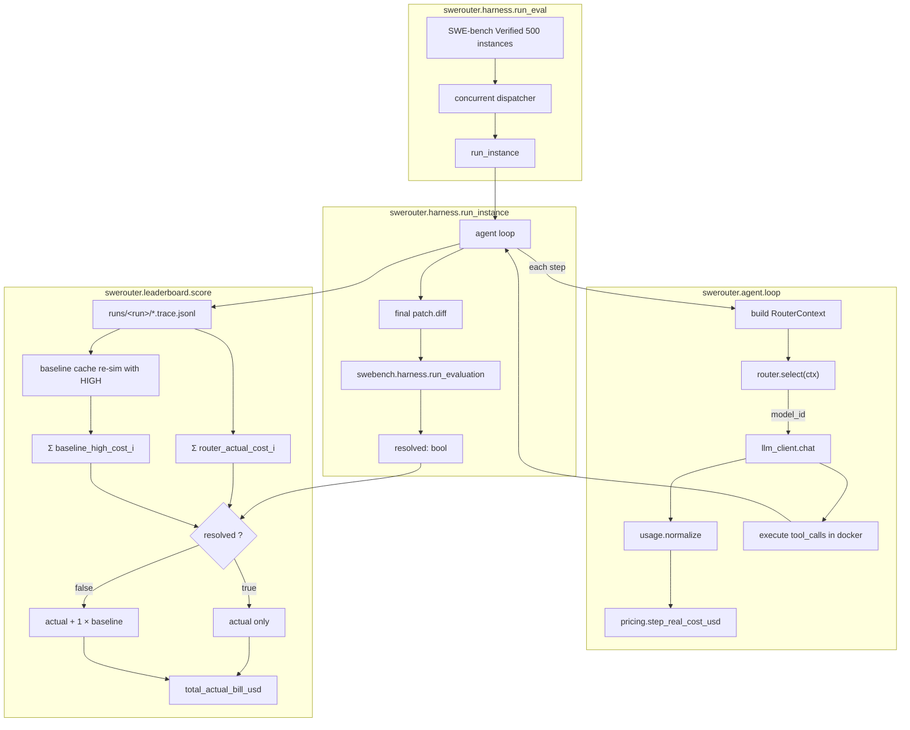

# SWERouterBench 架构设计（内部）

> 读者：SWERouterBench / CommonRouterBench 内部开发者。对外（README / blog）以英文为准。

## 1. 项目定位

SWERouterBench 是 CommonRouterBench 的**动态姊妹包**。同一个 monorepo / workspace 下，两者共存但**独立发 GitHub repo、独立发 PyPI**。

| 维度 | CommonRouterBench (CRB) | SWERouterBench (本项目) |
|---|---|---|
| 评测对象 | 静态题库 `data/static/question_bank.jsonl`，路由监督步骤 | 动态，真跑 SWE-bench Verified 500 个 instance |
| Router 契约 | `f(row) -> tier_id ∈ {0,1,2,3}` | `router.select(ctx) -> RouterDecision(model_id)` |
| 定价 | `main.pricing` 档位名义价 | `data/model_pricing.json` 厂商真实价 |
| Cache 建模 | 步距 TTL=3，`main.tokenizer` 估算 token | Wall-clock TTL=300s，API 实 usage 四桶归一 |
| Pass 判据 | `pred_tier_id >= gold_tier_id` | SWE-bench 官方 `resolved`（FAIL_TO_PASS + PASS_TO_PASS） |
| 打分 | `scores_v2.combined_score`（4 项平均） | **单一指标** `total_actual_bill_usd`（越低越好） |
| 重依赖 | `requests + tiktoken + tokenizers` | 上面 + `swebench + docker` |
| 发布包 | PyPI `CommonRouterBench`，import `main` | PyPI `SWERouterBench`，import `swerouter` |

两者**通过 PyPI 依赖衔接**：`SWERouterBench.pyproject.toml` 里 `dependencies = ["CommonRouterBench>=0.1.0", ...]`，复用 `main.tokenizer`、`main.router_llm` 等基建。

## 2. SWE-bench 集成方式：Clean dep（不 vendor）

已有的 SWE-bench 官方 clone 放在 `bench_git/SWE-bench/` 作**只读参考**（保留上游 `.git`，便于 `git pull` 跟上游、查 `swebench.harness` 源码）。SWERouterBench 只通过 `pip install swebench` 作为依赖调用，不在本 repo 内 vendor / patch 上游源码。

后果：任何对 `swebench.harness` 行为的修改只能走**上游 PR**。本项目自己写的 agent scaffold、router 接口、pricing、cache、scoring 全部在 `swerouter/` 下独立实现。

## 3. 顶层架构



## 4. 模块边界

| 模块 | 职责 | 下游依赖 |
|---|---|---|
| `swerouter.router` | Router 协议 + 上下文数据结构 + fail-fast 校验 | 无（纯 dataclass / Protocol） |
| `swerouter.pricing` | 读取 `data/model_pricing.json`，4 桶真实价 → USD | `data/model_pricing.json` |
| `swerouter.cache` | wall-clock 5min TTL；语义前缀匹配；cache hit / miss 诊断 | `data/ttl_policy.json` |
| `swerouter.usage` | 各厂商 `usage` 字段 → 4 桶归一 | 无 |
| `swerouter.llm_client` | OpenAI 兼容 chat，Anthropic 注入 cache_control 块；返回 raw + normalized usage | `usage` + `cache` |
| `swerouter.agent.tools` | bash / str_replace_editor / view / create / finish 工具实现（docker exec） | `docker` |
| `swerouter.agent.prompts` | SWE-bench reference 对齐的 system prompt | 无 |
| `swerouter.agent.loop` | tool-use 主循环：每轮 `router.select → chat → exec tool` | `router` + `llm_client` + `agent.tools` |
| `swerouter.harness.run_instance` | 跑单 instance：agent loop + `swebench.harness.run_evaluation` | `agent.loop` + `swebench` |
| `swerouter.harness.run_eval` | 并发跑 N 实例 + resume + 进度 + summary | `harness.run_instance` |
| `swerouter.leaderboard.score` | trace.jsonl → instance_bill → 总账单 + 辅助统计 | `pricing` + `cache` |
| `swerouter.leaderboard.render` | 排行榜 markdown / HTML | `score` |
| `swerouter.routers.*` | 参考 router 实现（AlwaysModel / RoundRobin / TierFromCRB） | `router` + CRB `main.router_llm` |
| `swerouter.cli` | 跑分入口 | 全部 |

## 5. 已冻结的关键决策

已在 plan 文件里固化，此处仅做单一事实源引用，不重复列表。每一条决策都对应 `docs/` 下一份更详细的说明：

- Router 接口、fail-fast 校验 → `docs/router_api_zh.md`
- 真实定价、模型池锁定、TTL、usage 归一 → `docs/pricing_and_cache_zh.md`
- 总账单公式、失败 1× baseline 惩罚、baseline cache 重模拟 → `docs/scoring_zh.md`

## 6. 目录约定

```
SWERouterBench/
├── swerouter/                  # import package
├── data/                       # 锁定的 pool / pricing / ttl 配置（随包发布）
├── scripts/                    # 运行与维护脚本（非 import，非 PyPI 打包）
├── tests/                      # pytest
├── docs/                       # 本目录：内部中文设计 + 对外英文博客
├── pyproject.toml
├── README.md / README.zh.md / CHANGELOG.md / LICENSE
```

**运行产物**（`runs/`、`outputs/`、`*.trace.jsonl`）一律 gitignore，不进 repo。
